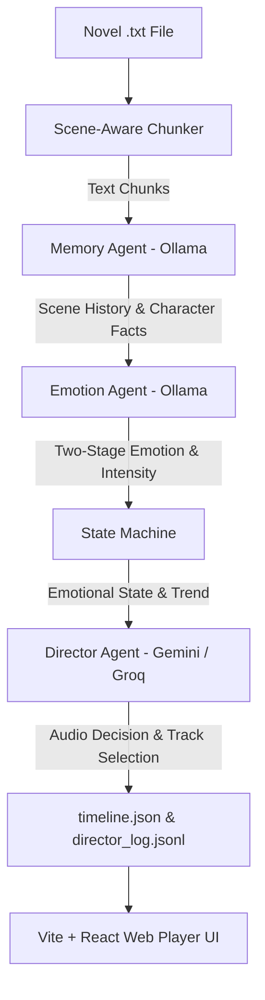

# Emotion-Aware Music POC

An end-to-end AI pipeline and web reader that transforms novel text into a dynamic, emotion-driven soundtrack. 

The system parses novels, analyzes narrative scenes, tracks character facts and memory context via local LLMs (**Ollama**), evaluates emotional shifts, and routes audio transition decisions through a cloud Director (**Gemini** or **Groq**). It then renders an interactive reading UI built with **React** and **Vite**.

---

## 🏗 Architecture & Pipeline



### Pipeline Steps:
1. **Scene-Aware Chunking**: Splits text into ~600-word scenes while ensuring mid-paragraph splits never occur.
2. **Memory Agent (Ollama)**: Summarizes facts, updates character profiles, and maintains scene history without context drift.
3. **Emotion Agent (Ollama)**: Two-stage classification determining dominant emotion, sub-emotion, and intensity (0–100%).
4. **State Machine**: Tracks emotion transitions, intensity trends, and enforces continuity rules.
5. **Director Agent (Gemini / Groq)**: Decides whether to `hold`, `crossfade`, or `fade_out` tracks, preventing jarring audio switches.
6. **Timeline & UI**: Output `timeline.json` powers the interactive React reading interface.

---

## ✨ Key Features

- **Local + Cloud Hybrid Execution**: Runs context memory and emotion classification locally on Ollama; offloads high-level directorial reasoning to Gemini or Groq APIs.
- **Resumable Caching System**: Granular per-chunk cache ensures that interruptions allow the pipeline to pick up right where it left off without wasting LLM calls.
- **Memory & Character Tracking**: Tracks durable character facts (appearance, traits) and transient scene events separately to keep prompt sizes efficient.
- **25-Label Emotion Taxonomy**: Structured emotional spectrum supporting fine-grained sub-emotions (e.g., *Fear -> Panic*, *Interest -> Curiosity*).
- **Interactive React Web Player**: Includes a live reading mode, real-time emotion intensity meters, interactive scene timeline charts, and manual JSON timeline upload.

---

## 📁 Repository Structure

```
emotion-music-poc/
├── .env.example            # Environment variable template (API keys)
├── .gitignore              # Ignores .env, cache/, node_modules, build files
├── config.py              # Central configuration (models, thresholds, paths)
├── taxonomy.py            # 25-label emotion classification taxonomy
├── tracks.py              # Emotion + intensity to track ID mapping logic
├── ollama_client.py        # Wrapper for local Ollama HTTP API
├── gemini_client.py       # REST client for Google Gemini API
├── groq_client.py         # OpenAI-compatible client for Groq API
├── director_llm.py        # Multi-provider router for Director agent
├── chunker.py             # Paragraph-safe novel text chunker
├── memory_agent.py        # Extract scene summaries and character facts
├── memory_store.py        # Persistent JSON storage for scene history & character data
├── emotion_agent.py       # Two-stage classification (Dominant & Sub-emotion)
├── state_machine.py       # Emotion continuity and intensity tracking
├── director.py            # Director agent prompting and track switch validation
├── main.py                # Main CLI orchestrator pipeline
├── novels/                 # Input novel .txt files directory
│   └── (your_novel.txt)
├── cache/                  # Generated working data & final timeline files
│   └── <book_id>/
│       ├── chunks/          # Raw scene text per chunk
│       ├── memory/          # Character facts, relationships & scene history
│       ├── emotions/        # Raw classifier output per chunk
│       ├── state.json        # Current state machine snapshot
│       ├── timeline.json     # Final track timeline read by the web UI
│       └── director_log.jsonl# Director reasoning and audit logs
├── package.json            # Node.js dependencies for Vite/React web player
├── vite.config.js          # Vite configuration
├── index.html              # Frontend HTML entrypoint
└── src/                    # Web Player React source code
    ├── main.jsx            # Interactive reader app component
    └── style.css           # UI layout and mood styling
```

---

## 📋 Prerequisites

- **Python**: 3.9 or higher
- **Node.js**: 18.x or higher & `npm`
- **Ollama**: Installed and running locally ([ollama.ai](https://ollama.ai))
- **API Key**: Gemini API key ([Google AI Studio](https://aistudio.google.com)) or Groq API key ([Groq Console](https://console.groq.com))

---

## ⚙️ Setup & Configuration

### 1. Python Environment Setup

Install required Python packages:

```bash
pip install -r requirements.txt
```

Start Ollama and pull your desired local model (default: `qwen3:8b`):

```bash
ollama pull qwen3:8b
```

### 2. Frontend Environment Setup

Install Node.js dependencies:

```bash
npm install
```

### 3. API Key & Environment Config

Copy the example environment file:

```bash
# On Linux / macOS / Git Bash:
cp .env.example .env

# On PowerShell:
Copy-Item .env.example .env
```

Edit `.env` and set your preferred keys and options:

```env
# Gemini Configuration
GEMINI_API_KEY=your_gemini_api_key_here

# Groq Configuration (Optional)
GROQ_API_KEY=your_groq_api_key_here

# Director Provider ("gemini" or "groq")
DIRECTOR_PROVIDER=gemini
```

Alternatively, set environment variables directly in your terminal:

```bash
# PowerShell
$env:GEMINI_API_KEY="your-api-key"

# Bash / Zsh
export GEMINI_API_KEY="your-api-key"
```

---

## 🚀 Running the Pipeline

Place your target novel as a plain `.txt` file in `novels/` (e.g., `novels/ReZero.txt`).

### Basic Run

```bash
python main.py --book novels/ReZero.txt --book-id ReZero
```

*Note: Running with an existing `--book-id` automatically resumes execution from the last uncompleted chunk.*

### Advanced Options & Overrides

```bash
python main.py --book novels/ReZero.txt --book-id ReZero \
    --ollama-model qwen3:8b \
    --director-provider groq \
    --director-model llama-3.3-70b-versatile \
    --max-chunk-words 600 \
    --limit 20
```

#### Available CLI Arguments:
- `--book`: Path to the novel text file (*required*).
- `--book-id`: Unique identifier for caching output files (*required*).
- `--ollama-model`: Local Ollama model name (default: `qwen3:8b`).
- `--director-provider`: Cloud LLM provider for director (`gemini` or `groq`, default: `gemini`).
- `--director-model`: Specific model name override for Gemini or Groq.
- `--max-chunk-words`: Soft word limit per scene chunk (default: `600`).
- `--limit`: Only process the first N chunks (useful for testing).

---

## 🌐 Running the Web Player UI

Start the local development server:

```bash
npm run dev
```

Open the printed URL (typically `http://localhost:5173`) in your web browser.

### Loading Timeline Data in the UI
- **Automatic Loading**: Copy your generated `timeline.json` into `public/data/<BOOK_ID>/timeline.json`.
- **Manual Upload**: Click the **Upload** button in the **Library** tab of the web app and select any `timeline.json` file from `cache/<book_id>/timeline.json`.

---

## 🛠 Customization

- **`config.py`**: Adjust model defaults, Ollama timeouts, scene history windows (`SCENE_HISTORY_WINDOW`), character fact caps (`MAX_CHARACTER_TRAITS`), and continuity confidence thresholds.
- **`taxonomy.py`**: Modify or extend the 25-label emotion taxonomy.
- **`tracks.py`**: Customize audio track mappings based on detected dominant emotions and intensity levels.

---

## 📊 Cache & Output Data Format

Generated output is stored under `cache/<book_id>/`:

- **`timeline.json`**: Final sequence of scene chunks, detected emotions, intensities, and track decision actions (`hold`, `crossfade`, `fade_out`).
- **`director_log.jsonl`**: Detailed audit trail containing the Director's raw reasoning and evaluations for debugging music timing.
- **`memory/`**: Persistent scene summaries (`scene_history.json`), accumulated character profiles (`characters.json`), and relationship data (`relationships.json`).

---

## 📄 License

MIT License. See project files for details.
